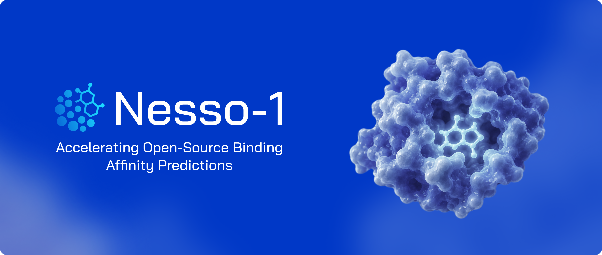

<div align="center">



[](LICENSE)


[Technical Report](https://www.valencelabs.com/wp-content/uploads/2026/07/nesso1.pdf) &bull; [Model Weights](https://huggingface.co/recursionpharma/nesso) &bull; [License](LICENSE)

</div>

This repository contains the code for Nesso-1, a coarse-grained cofolding model that can predict binding affinity. For more details about the method and evaluations, refer to this [Technical Report](https://www.valencelabs.com/wp-content/uploads/2026/07/nesso1.pdf). This project is licensed under a permissive [Apache License 2.0](LICENSE).

## Contents

- [Installation](#installation)
- [Quick Start](#quick-start)
- [Documentation](#documentation)
- [Coming Soon](#coming-soon)
- [Citation](#citation)
- [License](#license)
- [Acknowledgements](#acknowledgements)

## Installation

> PyPI release coming soon!

```bash
pip install "git+https://github.com/recursionpharma/nesso.git"
```

<b><u>GPU / CUDA</u></b> : The `nesso` package relies on PyTorch. For GPU support, install a [CUDA-enabled PyTorch build](https://pytorch.org/get-started/locally/) first, then install `nesso`. To additionally enable [cuEquivariance](https://github.com/NVIDIA/cuEquivariance) kernels for extra speedups (CUDA 12 only; Apache License 2.0):

```bash
pip install "nesso[kernels] @ git+https://github.com/recursionpharma/nesso.git"
```

If the kernels extra fails to install or you are running on CPU, use the default install and/or pass `--no_kernels` at runtime.

### Development

We recommend using [uv](https://docs.astral.sh/uv/) to install the project in development mode.

```bash
git clone https://github.com/recursionpharma/nesso.git && cd nesso
uv sync                      # runtime + dev tools (pytest, ruff, pre-commit)
pytest                       # run the CPU-only test suite
pre-commit run --all-files   # lint + format
```

(Plain `pip install -e .` installs the runtime only; the dev tools live in the
`dev` dependency group, which `uv sync` installs.)

## Quick Start

**1. Create an input YAML** (e.g. `complex.yaml`):

```yaml
sequences:
  - protein:
      id: A
      sequence: MKTAYIAKQ...  # amino acid sequence
  - ligand:
      id: B
      smiles: "Fc1ccc(cc1)C(=O)Nc1ccc(cc1)S(=O)(=O)N"
properties:
  - affinity:
      binder: B
```

**2. Run prediction:**

```bash
nesso predict complex.yaml --out_dir ./output
```

Note: For input formats, caching, and all CLI options, see [docs/prediction.md](docs/prediction.md).

## Documentation

- [Prediction options and output format](docs/prediction.md)
- [Tutorial examples and feature extraction](tutorial/README.md)

## Coming Soon

- [ ] Pocket Conditioning
- [ ] Structural Templating

## Citation

```bibtex
@article{valencelabs2026nesso1,
  author = {Valence Labs, Recursion, Nikhil Shenoy, David Errington, Emmanuel Bengio, Kacper Kapu\'sniak, Kerstin Klaeser, Yui Tik Pang, Vladimir Radenkovic, Prudencio Tossou, Therence Bois, Andrew Wedlake, Francesco Di Giovanni},
  title = {Nesso-1: Accelerating Open-Source Binding Affinity Predictions},
  year = {2026}
}
```

## License

This project is licensed under [Apache License 2.0](LICENSE).

Third-party attributions: [licenses/THIRD_PARTY_NOTICES.md](licenses/THIRD_PARTY_NOTICES.md)

## Acknowledgements

We thank the following open-source codebases for enabling the development of this project,

- [cuEquivariance](https://github.com/NVIDIA/cuEquivariance), [Apache License 2.0](https://github.com/NVIDIA/cuEquivariance/blob/main/LICENSES/LICENSE)
- [Boltz2](https://github.com/jwohlwend/boltz), [MIT LICENSE](https://github.com/jwohlwend/boltz/blob/main/LICENSE)
- [OpenFold](https://github.com/aqlaboratory/openfold), [APACHE LICENSE](https://github.com/aqlaboratory/openfold/blob/main/LICENSE)
- [AlphaFold3 by Lucidrains](https://github.com/lucidrains/alphafold3-pytorch), [MIT LICENSE](https://github.com/lucidrains/alphafold3-pytorch/blob/main/LICENSE)
- [ESM](https://github.com/facebookresearch/ESM), [MIT LICENSE](https://github.com/facebookresearch/ESM#license)
